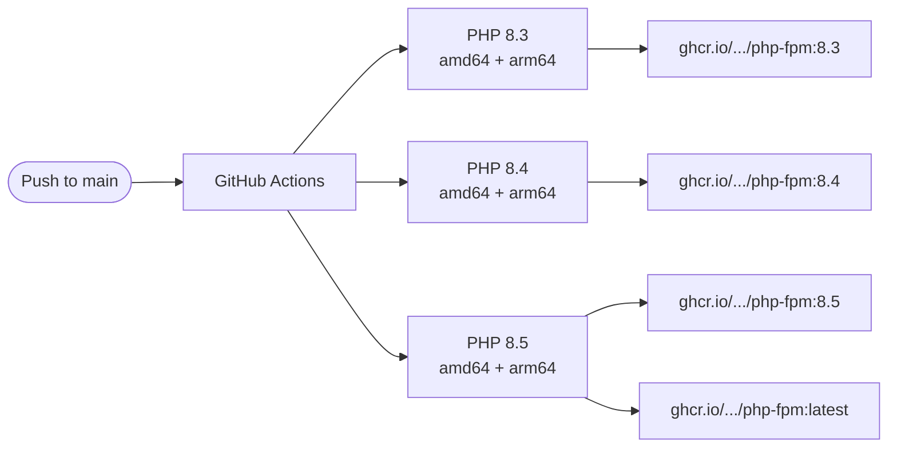

# php-fpm

[](LICENSE)
[](https://github.com/aprakasa/php-fpm/actions/workflows/build.yml)
[](https://www.php.net/)
[](https://www.php.net/)
[](https://www.php.net/)
[](https://github.com/aprakasa/php-fpm/pkgs/container/php-fpm)

Pre-built PHP-FPM Docker images for WordPress, published to GHCR.

## Images

| Tag | PHP Version | Platform |
|-----|-------------|----------|
| `ghcr.io/aprakasa/php-fpm:8.3` | 8.3 | linux/amd64, linux/arm64 |
| `ghcr.io/aprakasa/php-fpm:8.4` | 8.4 | linux/amd64, linux/arm64 |
| `ghcr.io/aprakasa/php-fpm:8.5` | 8.5 (default) | linux/amd64, linux/arm64 |
| `ghcr.io/aprakasa/php-fpm:latest` | 8.5 | linux/amd64, linux/arm64 |

## CI Pipeline



## What's Included

**Base**: `php:${VERSION}-fpm-alpine`

**PHP Extensions**: bcmath, exif, gd (freetype + jpeg + webp), intl, mysqli, pcntl, pdo_mysql, pdo_sqlite, sqlite3, zip, redis (6.3.0), imagick (3.8.1), Zend OPcache

> `opcache`, `pdo_sqlite`, and `sqlite3` are statically compiled into PHP's official Alpine images — no separate build needed.

**Build**: Multi-stage Dockerfile separates compilation from runtime for smaller images and better layer caching.

**Tools**: WP-CLI

**Default Configs** (baked into image, overridable via volume mount):
- `conf/opcache.ini` — OPcache + JIT settings
- `conf/custom.ini` — PHP runtime settings with security hardening
- `conf/zz-docker.conf` — PHP-FPM pool config (Unix socket)

**Entrypoint**: WordPress auto-setup (download, configure, install), cache plugin installation, Redis object cache enablement.

## Usage

```yaml
services:
  php-fpm:
    image: ghcr.io/aprakasa/php-fpm:8.5
    volumes:
      - wordpress_data:/var/www/html
      - php_socket:/var/run/php-fpm
      # Override defaults:
      - ./php/opcache.ini:/usr/local/etc/php/conf.d/opcache.ini
      - ./php/custom.ini:/usr/local/etc/php/conf.d/custom.ini
      - ./php/zz-docker.conf:/usr/local/etc/php-fpm.d/zz-docker.conf
```

## Environment Variables

| Variable | Default | Description |
|----------|---------|-------------|
| `MARIADB_HOST` | `mariadb` | MariaDB hostname |
| `MARIADB_DATABASE` | — | Database name |
| `MARIADB_USER` | — | Database user |
| `MARIADB_PASSWORD` | — | Database password (required) |
| `MARIADB_ROOT_PASSWORD` | — | Root password (required) |
| `DOMAIN` | `localhost` | WordPress site URL |
| `WP_VERSION` | `latest` | WordPress version |
| `WP_LOCALE` | `en_US` | WordPress locale |
| `WP_MULTISITE` | `no` | `no`, `subdirectory`, or `subdomain` |
| `CACHE_MODE` | `fastcgi-cache` | `fastcgi-cache`, `wp-rocket`, `cache-enabler`, `wp-super-cache`, `redis-cache` |
| `WORDPRESS_ADMIN_USER` | `admin` | Admin username |
| `WORDPRESS_ADMIN_PASSWORD` | — | Admin password (required) |
| `WORDPRESS_ADMIN_EMAIL` | — | Admin email (required) |
| `WORDPRESS_SITE_TITLE` | `WordPress` | Site title |
| `SSL` | `0` | Set to `1` to force SSL admin |
| `REDIS_HOST` | `/var/run/redis/redis.sock` | Redis host or socket path |

## Building Locally

```bash
docker build --build-arg PHP_VERSION=8.5 -t php-fpm:local .
```

## CI

Pushes to `main` trigger GitHub Actions builds for all three PHP versions. Tags create versioned images (e.g., `v1.0.0-8.5`).

## License

[MIT](LICENSE)
